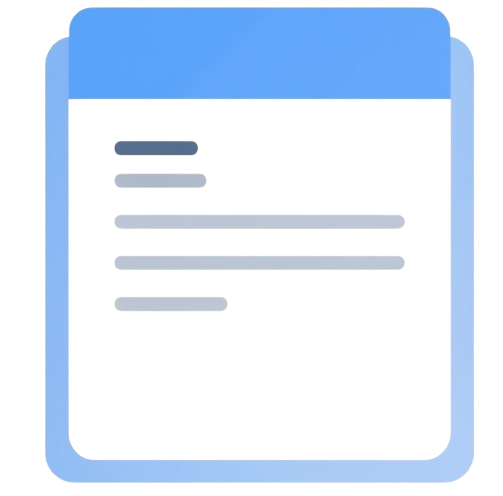

<p align="center">
  
</p>

# Bropad 📝

**Bropad** adalah aplikasi catatan berbasis Markdown, dibangun dengan Python + GTK.
Simpel. Lokal. Tanpa sinkronisasi. Cukup ketik dan simpan, kayak bro sejati 😎

---

## ✨ Fitur Utama

- 📁 Semua catatan disimpan sebagai file `.md` di folder lokal
- 🗂️ Sidebar daftar catatan
- 📝 Editor dengan dukungan syntax highlighting
- 💾 Tombol "New Note" dan "Save"
- 🖥️ Panel preview Markdown (toggle on/off)
- 🔢 Toggle line numbers
- 📜 Menu `About` dengan info dan lisensi
- 🖱️ Klik kanan pada note: Rename & Delete

---

## 🛠️ Teknologi yang Digunakan

- Python 3
- PyGObject (GTK 3, WebKit2, GtkSourceView)
- [markdown2](https://github.com/trentm/python-markdown2)

---

## 📌 Rencana Fitur / Roadmap

> Berikut beberapa ide dan fitur tambahan yang direncanakan:

- [ ] 🔄 **Auto Save** (opsional toggle)
- [ ] 🧠 **Shortcut Keyboard**:
  - `Ctrl+S` untuk Save
  - `Ctrl+N` untuk Note Baru
  - `Ctrl+P` untuk Toggle Preview
  - `Ctrl+L` untuk Line Number
- [ ] 🔍 **Pencarian Catatan**
- [ ] 🏷️ **Tag system / metadata di awal file**
- [ ] 📊 Word count & character count
- [ ] 🌙 **Dark Mode**
- [ ] 🖨️ Export ke **PDF** atau **HTML**
- [ ] ⬆️ Sortir notes berdasarkan tanggal dibuat / diubah
- [ ] ⚙️ Sistem plugin sederhana
- [ ] 🔧 Config global (folder `config.py` untuk setting manual)
- [ ] 📂 Custom **path direktori catatan**
- [ ] 🔧 Global config (`config.py`)

---

## 📸 Screenshot

> (Tambahkan gambar nanti di sini, misal `assets/screenshot.png`)

---

## 👤 Kontributor

- Angga Purnama (<anggagewor@gmail.com>)

---

## 📄 Lisensi

Lihat file [LICENSE](./LICENSE) untuk detail.

---

## 🚀 Jalankan

```bash
python3 bropad.py
